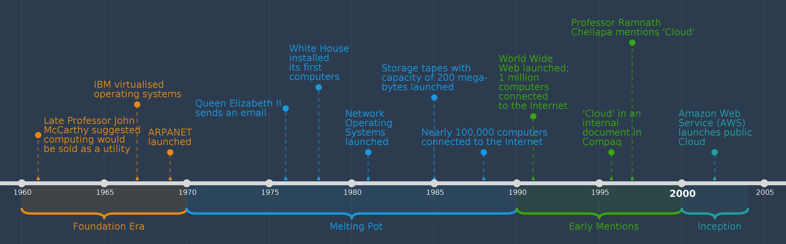
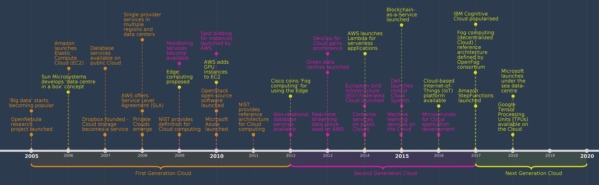

- [My info & Paper selection](#my-info--paper-selection)
- [How each of selected papers relate to each other in big picture](#how-each-of-selected-papers-relate-to-each-other-in-big-picture)
- [Problems of the papers](#problems-of-the-papers)
- [Methods & Evaulation of the papers](#methods--evaulation-of-the-papers)
  - [Lamport](#lamport)
  - [Xen](#xen)
  - [Tracing](#tracing)
- [How each of paper is complementary to each other in detail](#how-each-of-paper-is-complementary-to-each-other-in-detail)

## My info & Paper selection

My name is **Zhaoqi Zhang**. I am writing this blog for the creative project for Comp 118 at Tufts Univesity in Fall 2020.

Since I submit the URL of this blog, which obviously means that **I am doing `Option 1: Explain research to a general audience` for the creative project.**

I am interested in **debugging tools for Cloud Computing**. I want to discuss how distributed tracing (workflow-centric tracing) fits in cloud computing, tracing origin, and how it is affected by cloud development, especially IaaS.

Thus, **I selected the following paper**:

1. [Lamport'78](https://dl.acm.org/doi/10.1145/359545.359563): `Time, clocks, and the ordering of events in a distributed system`, which is the math base of distributed tracing.
2. [Barham'03](https://dl.acm.org/citation.cfm?id=945462): `Xen and the art of virtualization`, the VM paper. I want to discuss how Xen affect distributed tracing as the key enabler of cloud.
3. [Sambasivan16](https://dl.acm.org/doi/10.1145/2987550.2987568): `Principled workflow-centric tracing of distributed systems` describes the workflow-centric tracing as debugging tool.****

___
For the sake of simplicity, I will use **Lamport Clock**, **Xen**, and **Tracing** to refer these three resepctively in the following sections of this blog.

## How each of selected papers relate to each other in big picture

As I mentioned above, the topic of my blog writing is debugging tools. This blog's overall goal is to connect distributed tracing with its math origin and its major influencer.

To organize my writing,

- I want to start with the math of Lamport clock.
- Then talk about Xen and IaaS since Xen was introduced as the key enabler of cloud.
- Later, introduce workflow-centric tracing as debugging tools.
- At last, I would summrize the above points based on debugging tools in the cloud. With a little bit discussion about how Lamport clock help in tracing, I would explian how cloud affect traditional debugging, then eventually arrive our destination topic debugging tools for cloud.

## Problems of the papers

| Papers        | Research Problems                                                                                                                               |                                                     |
|---------------|-------------------------------------------------------------------------------------------------------------------------------------------------|-----------------------------------------------------|
| Lamport-clock | How to define the order in which events occur in distributed system                                                                             |                                                     |
| Xen           | How to host multiple applications and servers efficiently (make configuration simpler and faster)  while maintaining security and functionality | How to isolate their performance-related resources? |
| Tracing       | How tracing infrastructures should be designed to provide maximum benefit for essential management tasks                                        |                                                     |

Even though this part is relatively simple, I still want to point out that Lamport-clock provides rigorous math definition for both Xen and Tracing. What Xen result in is cloud that provides millions of VM for different customers, which we should remember the event order is defined by Lamport-clock. As for Tracing, the corelationship between Lamport-clock is more clearer that it is defined on Lamport's happens-before relationship.

## Methods & Evaulation of the papers

### Lamport

In this section, I will discuss about the methodology and evaluation of `Time, clocks, and the ordering of events in a distributed system`

- **Methodology**

    A distributed algorithm is given for synchronizing a system of logical
    clocks which can be used to totally order the events.The use of the total ordering is illustrated with a method for solving synchronization problems. The algorithm is then specialized for synchronizing physical clocks, and a bound is derived on how far out of synchrony the clocks can become.

    The authors discuss the partial ordering defined by the "happened before" relation, and give a distributed algorithm for extending it to a consistent total ordering of all the events. This algorithm can provide a useful mechanism for implementing a distributed system. They illustrate its use with a simple method for solving synchronization problems. Unexpected, anomalous behavior can occur if the ordering obtained by this algorithm differs from that perceived by the user. This can be avoided by introducing real, physical clocks. The authors describe a simple method for synchronizing these clocks, and derive an upper bound on how far out of synchrony they can drift.

- **Evaulation**

    The total ordering defined by the algorithm is somewhat arbitrary. It can produce anomalous behavior if it disagrees with the ordering perceived by the system's users. This can be prevented by the use of properly synchronized physical clocks. Their theorem showed how closely the clocks can be synchronized. In a distributed system, it is important to realize that the order in which events occur is only a partial ordering. They believe that this idea is useful in understanding any multiprocess system. It should help one to understand the basic problems of multiprocessing independently of the mechanisms used to solve them.

    Besides, they also provides a detailed proof of the Theorem. I take this as a addiontion of evaulation.

### Xen

In this section, I will discuss about the methodology and evaluation of `Xen and the art of virtualization`

- **Methodology**

    The authors proposed an OS-level multiplexing which brings flexibility to coexist different OS in one machine and provides performance isolation between them.

    Starting from the proven direction of previous researches, Xen used a design principle of retrofitting support for performance isolation to the operating system. However, the authors implement the same strategy at a different level—they used OS-level multiplexing instead of process-level multiplexing. With multiplexing at the granularity of an entire operating system, it naturally provides performance isolation between them and allows a range of guest OSes to gracefully coexist rather than mandating a specific application binary interface.

- **Evaulation**

    As for evaluation, the authors conducted a series of experiments about its features. They begin by benchmarking it against a number of alternative virtualization techniques. Then, they compare the total system throughput executing multiple applications concurrently on a single native operating system against running each application in its own virtual machine. Later, they evaluate the performance isolation that Xen provides between guest OSes and assess the total overhead of running large numbers of operating systems on the same hardware.

### Tracing

In this section, I will discuss about the methodology and evaluation of `Principled workflow-centric tracing of distributed systems`

- **Methodology**

    This paper investigates and analyzes the existing workflow-centric tracing solutions and methodology(design axes) to design such tracing systems. Then the author distills the design space of workflow-centric tracing and describes key design choices that help or hinder a tracing infrastructure’s utility for crucial duties. Eventually, the author offers serval guidelines based on different tracing requirements.

    Despite there is a strong interest from industry in workflow-centric tracing infrastructures, there is very little clarity about how they should be designed to provide maximum benefit. Without research into this critical question, there is a danger that future tracing implementations will not live up to expectations and that the potential of workflow-centric tracing will be squandered.Here comes very necessary and vital needs  for the following section’s analysis--to categorize essential management tasks, to set foundational component, and to analyze method of preserving causal relationship.The author indicates there are mainly six management tasks covering from anomalous workflows, distributed profiling to dynamic monitoring. The tracing infrastructure's core components are metadata and propagational tracepoints with additional tracing components like value-added tracepoints, overhead-reduction mechanism, and storage & reconstruction component. The author also gives the definition of two methods of causality preserving method—submitter causality and trigger causality.

- **Contribution**

    However, it is not necessary to evaluate this paper since what the paper does is giving evaulation and suggetion of existing industrial tracing product. So I change the title to contribution of this paper. Anyway, the following part is my favorite.

    The remaining part of the paper is magic. Firstly, the author analyzes the different strategies of adding tracepoints for propagational tracepoints and value-added tracepoints because of different homogeneity degrees. Engineers can make use of homogeneous components of propagational tracepoints to help easing the effort of instrumentation. At the same time, value-add tracepoints do not require much and provides the rugged dynamic instrumentation. Second, the author investigates several limiting overhead approaches introduced by the tracing system, especially a significant contributor, aggregation, and stymying the overhead-reduction technique. For out-of-band execution, network overhead is not a concern such that there are three types of sampling utilized—head-based coherent sampling, tail-based sampling, and hybrid sampling. And for in-band execution, strategies like lossy compression and partial execution are used to reduce tracing overhead. At last, the authors provide a detailed study of suggested design choices for various management tasks and options made by existing tracing implementations.

## How each of paper is complementary to each other in detail

___
Picture source: `https://www.bcs.org/content-hub/history-of-the-cloud/`

___

The art and science of developing, deploying, and operating software is constantly in flux. New advances in computing hardware and software have dramatically pushed the boundaries of what an application looks like over the years.

**Before Lamport Clock:**
In distributed systems, time is a problem. Each computer has a clock built in, but those clocks are independent. The clocks on different machines can vary quite a bit. If a human being is setting them, then they’re probably at best accurate to one second. Even using a protocol like NTP, which synchronizes clocks between different computers, you can only get the clocks accurate to within about a millisecond of each other.

For a lot of things that we want to do with a collection of computers, we need to know what event happened first.You get better fairness by using “send time” – that is, the time that the request was sent to the server by the client. But that’s where the clock issue comes up. Different machines don’t agree perfectly on the current time. If you use their clocktime to determine gets the lock first, then a machine with a slow clock will always get access before one with a fast clock. What you need is some fair way of determining ordering by some kind of timestamp that’s fair. There are a couple of algorithms for creating some notion of a clock or timestamp that’s fair and consistent. The very first one is **Lamport clock**.

**After Lamport Clock & Before Xen:**
With Lamport Clock, some distributed system was built and some standard of distributed was settled, like World Wide Web and Internet.

However, prior to advances in virtualization and containerization, if you needed to deploy some sort of web-based application, you would need a physical server, possibly one dedicated to your application itself. As traffic increased to your application, you would either need to increase the physical resources of that server (adding RAM, for example) or you would need multiple servers that each ran their own copy of your application.

**Virtualization:**
With virtualization introduced by **Xen**, public cloud is firstly launched by AWS around mid-2000s. With a monolithic server process, horizontal scaling that utilized by engineers to meet throughput growth often led to unfavorable tradeoffs in cost, performance, and organizational overhead. Running multiple instances of your server meant you were duplicating all functionality of the server, rather than scaling individual subcomponents independently. With traditional infrastructure, you were often forced to make a decision about how many minutes (or hours!) of degraded performance was acceptable while you brought additional capacity online servers are not cheap to run. Finally, as the size and complexity of your application increased, along with the amount of developers who were working on it, testing and validating new changes became more difficult. As your organization grew, it became unreasonable for developers to understand a single codebase, not to mention the shape of the entire system. Increasingly smaller changes increased the odds of a ripple effect that led to total application failure as their impact radiated out from one component to
another.

**Containerization:**
Althouht there is no paper available in our reading list, I do want to mention **container** because it is the solutions to these problems were built. Software was created that abstracted away the details of physical hardware such as virtualization, allowing for a single physical server to be split into multiple logical servers. Docker and other containerization technologies extended this concept, providing a lightweight and user-friendly abstraction over heavier-weight virtual machines, moving the question of “who deploys this software” from operators to developers. The popularization of cloud computing and its notion of on-demand computing resources solved the problem of resource scaling, as it became possible to increase the amount of RAM or CPU cores for a given server at the click of a button. Finally, the idea of microservice architectures came about to address the complexity imposed by everlarger and more complicated software-oriented businesses by structuring large appli‐cations around loosely coupled independent services.

**Before Tracing:**
Distributed architectures require a reimagined approach to understanding the health and performance of software. It’s not enough to simply look at a single stack trace or watch graphs of CPU and memory utilization. As software scales in depth, but also in breadth, telemetry data like logs and metrics alone don’t provide the clarity yourequire to quickly identify problems in production.

Distributing your software presents new and exciting challenges. Suddenly, failures and crashes become harder to pin down. The service that you’re responsible for may be receiving data that’s malformed or unexpected from a source that you don’t control because that service is managed by a team halfway across the globe (or a remote team). Failures in services that you thought were rock-solid suddenly cause cascading failures and errors across all of your services.

**Tracing:**
**Distributed tracing** emerges as a critical tool in managing the explosion of complexity that our deep systems bring. It provides context that spans the life of a request by structing logging in a manner of happens-before relationship, and can be used to understand the interactions and shape of your architecture. However, these individual traces are just the beginning in aggregate, traces can give you important insights about what’s actually going on in your distributed system, allowing you not only to correlate interesting data about your services (for example, that most of your errors are happening on a specific host or in a specific database cluster), but also to filter and rank the importance of other types of telemetry. Effectively, dis‐ tributed traces provide context that helps you filter problem-solving down to only things that are relevant to your investigation, so you don’t have to guess and check multiple logs and dashboards. In this way, distributed tracing is actually at the center of a modern observability platform, and it becomes a critical component of your distributed architecture rather than an isolated tool.